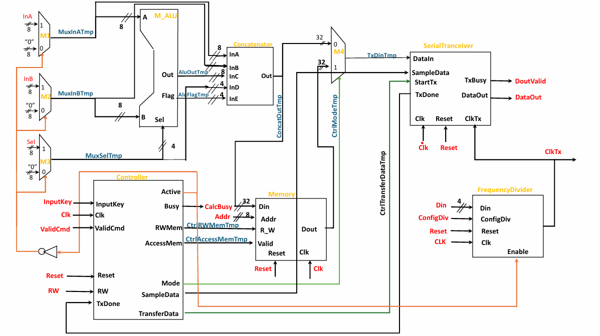
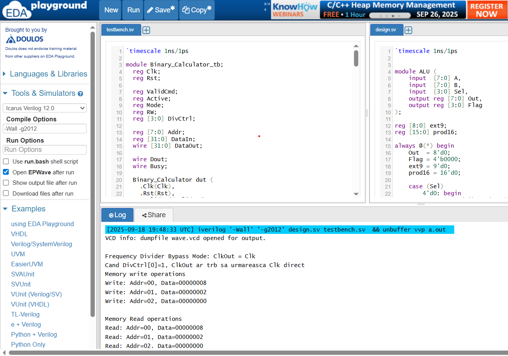
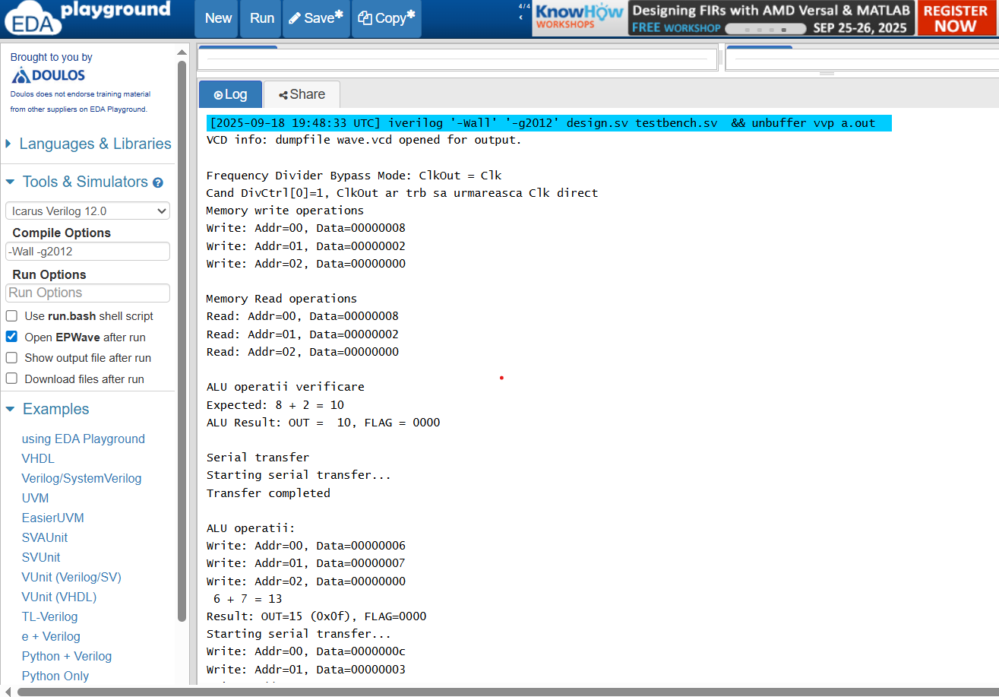
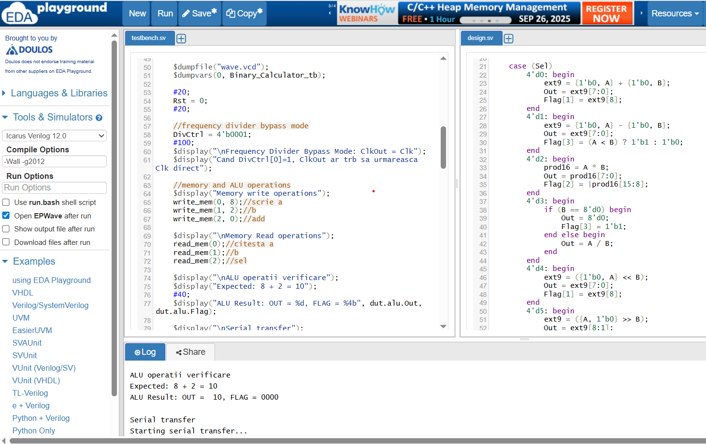
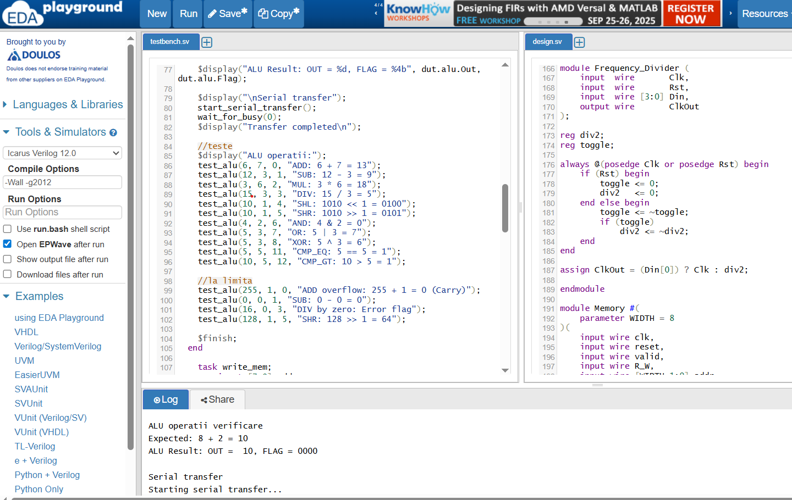
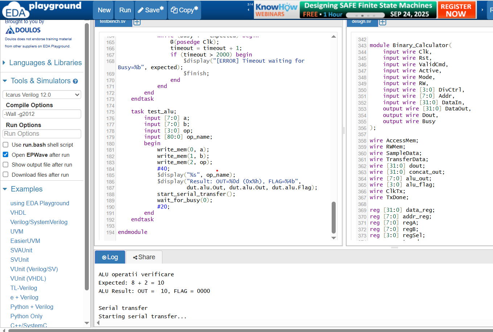
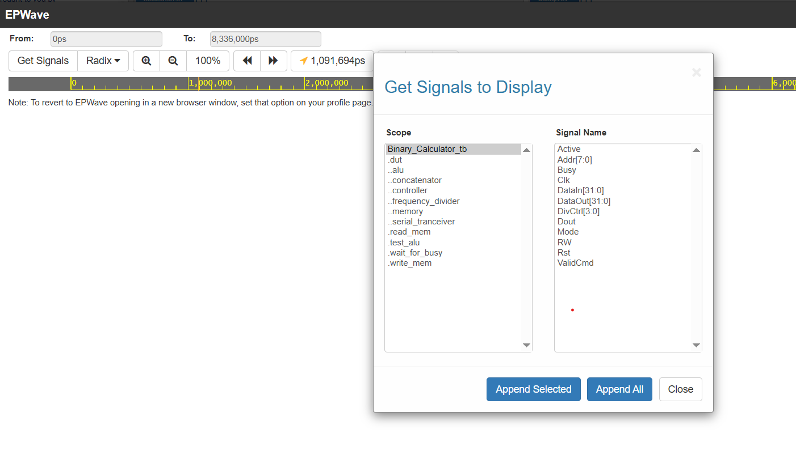
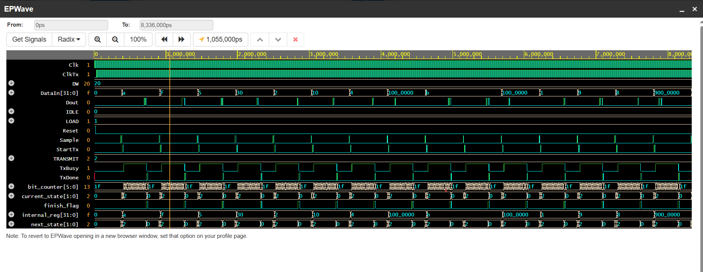
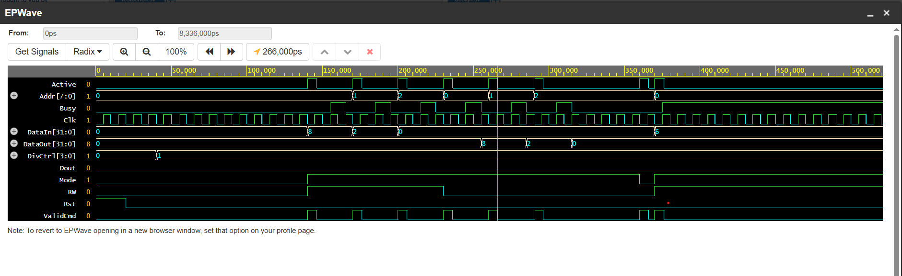

# Calculator Binar - Proiect Verilog

## Descriere proiect

Acest proiect implementează un calculator binar în Verilog, format din mai multe module interconectate:

- **ALU (Arithmetic Logic Unit)** – unitatea care realizează operații aritmetice și logice;
- **Memory** – memorie simplă pentru stocarea datelor și a instrucțiunilor;
- **Controller** – unitatea de control care gestionează semnalele pentru citire/scriere și transmiterea de date;
- **Frequency Divider** – împarte frecvența ceasului pentru modulele dependente de timp;
- **Serial Transceiver** – transmite rezultatele ALU serial, cu semnal Dout;
- **Concatenator** – formează un cuvânt pe 32 biți din rezultatele ALU + flag-uri;
- **Top-level (Binary Calculator)** – integrează toate modulele și expune interfața către utilizator;

Proiectul include și un testbench, Binary_Calculator_tb, care verifică funcționalitatea tuturor componentelor prin scenarii de test, precum operații ALU, acces la memorie, transfer serial, etc.



## Funcționalități implementate

### ALU
- **Operații suportate:**
  - ADD (0), SUB (1), MUL (2), DIV (3);
  - SHL (4), SHR (5);
  - AND (6), OR (7), XOR (8), XNOR (9), NAND (10);
  - CMP_EQ (11), CMP_GT (12).
- **Flag-uri:**
  - ZF – Zero Flag (rezultat = 0);
  - CF – Carry Flag (depășire la ADD/SHL/SHR);
  - OF – Overflow Flag (ex. MUL);
  - ERR – eroare (ex. diviziune la 0, subtracție negativă).

### Controller
- Gestionează comenzi valide (ValidCmd, Active);
- Decide modul de lucru: Memorie sau Serial Transfer;
- Controlează semnalele AccessMem, RWMem, SampleData, TransferData, Busy.

### Memory
- 256 locații de memorie (default WIDTH=8 -> 2^8 = 256 adrese);
- Operații citire/scriere controlate de semnalele de la Controller.

### Frequency Divider
- Împarte frecvența ceasului la 2, dacă DivCtrl[0] = 0;
- Dacă DivCtrl[0] = 1, ieșirea urmează direct semnalul Clk.

### Serial Transceiver
- Primește un cuvânt pe 32 biți (DataIn);
- Îl transmite serial prin pinul Dout;
- Semnale de stare: TxBusy, TxDone.

### Testbench
- Inițializează calculatorul și testează:
  - Scriere/citire din memorie;
  - Operații ALU (ADD, SUB, MUL, DIV, logice, comparații);
  - Cazuri la limită (overflow, divizare la 0, shift);
  - Transfer serial;
- Salvează waveform în wave.vcd.

## Structura proiectului

- src -> "design.sv" – toate modulele interconectate;
- tb -> "testbench.sv" – testbench care verifică buna funcționare a tuturor componentelor.

## Cum se folosește

### Pe EDA Playground

1. **Deschide EDA Playground;**
2. **Copiază toate fișierele proiectului în editor;**
3. **Alege Icarus Verilog ca simulator;**
4. **Apasă Run pentru a compila și simula.** Pentru vizualizarea waveform-ului, se activează opțiunea pentru generarea fișierului .vcd și se deschide cu vizualizatorul integrat.

### Cu Icarus Verilog

1. **Compilează design și testbench**:
    ```bash
    iverilog -o sim src/*.sv tb/binary_calculator_tb.sv
    ```
2. **Rulează aplicația**:
    ```bash
    vvp sim
    ```
    Pentru vizualizarea waveform-ului, fișierul "wave.vcd" se generează automat în testbenc și se deschide cu GTKWave:
   ```bash
   gtkwave wave.vcd
   ```

## Exemplu interfață








## Autor

- Andrei Bujor

## Licență

Acest proiect este distribuit sub licența MIT.

